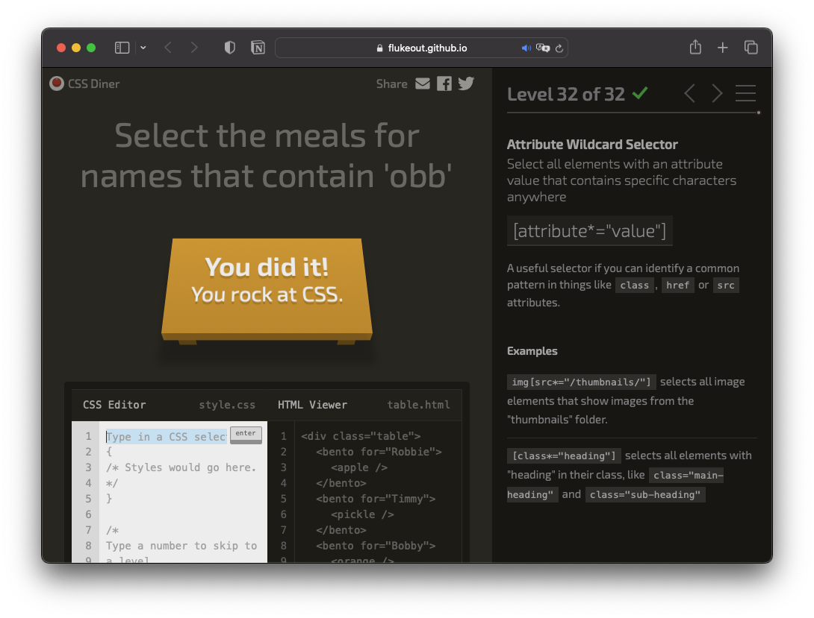

# CSS

[CSS 수업 - 생활코딩](https://opentutorials.org/course/2418)

해당 사이트의 내용을 기반으로 개인 스터디를 진행하였고, 진행하면서 중요하다고 생각하는 내용을 직접 정리하였습니다. 궁금하신 분들은 자유롭게 참고해주시면 될 것 같습니다 😊

---

# CSS Introduction

HTML is for information delivery.

People wanted to design their websites more beautifully.

## The start of design (in HTML) - `<font>`

[GitHub - jin-jae/Html-Study: HyperText Markup Language Study](https://github.com/jin-jae/Html-Study#font---do-not-use)

HTML became important in information delivery → but tags like `<font>` made it hard to understand what this text’s information is.

They made the design to be done in a new language which is ‘CSS’, and deleted the `<font>` tag in HTML.

## `<style>`

indicates that this is the CSS format definition

## Pros of CSS

Complete separation of information and design code

Design can be done in short code → code re-usage decreases

# Hello, CSS!

## HTML attribute

```html
<h1 style="color: red">
```

“color: red” is CSS grammar

## `<style>` tag

```css
<style>
	h2{color: blue}
</style>
```

“h2{color:blue}” is CSS grammar

# CSS Construction

## Selector

Select which to apply Declarations

## Declaration block

A declaration block consists of declaration(s)

### Declaration

- Property: which property to apply the value
- “:”: value-property separator
- Property value: what value should be applied to the property
- “;”: declaration separator

# CSS Selector

## Tag Selector

The base format does not require any prefixes.

For example, if you want to select tag `<h1>`, the selector will be like this:

```css
<style>
	h1 {
	}
</style>
```

## Class Selector

HTML tags can have a class attribute.

If you want to apply CSS in the same class, you should insert the “.” prefix.

For example, if you want to select tags which has the class “small”, the selector will be like this:

```css
<style>
	.small {
	}
</style>
```

If you want to apply CSS to the same class in a tag, it can be like this:

```css
<style>
	h1.small {
	}
</style>
```

## ID Selector

HTML tags can also have an id attribute.

If you want to apply CSS in an id, you should insert the “#” prefix.

(ID can also be used more than two times, but it is not recommended! Use “class” attributes and apply the class selector in this case!)

For example, if you want to select tags which has the id “student”, the selector will be like this:

```css
<style>
	#student {
	}
</style>
```

## Descendant Selector

If you want to apply CSS to tag `<li>` inside of the tag `<ol>`, the selector will be like this:

```css
<style>
	ol li {
	}
</style>
```

The descendant selector can also have the format “ID tag”. If you want to apply CSS to tag `<li>` inside of the tag which has ID “student”, the selector will be like this:

```css
<style>
	#student li {
	}
</style>
```

## Multiple Selector

Use “,” to apply CSS to more than one tag.

If you want to apply CSS to tag `<h1>` and `<h2>`, the selector will be like this:

```css
<style>
	h1, h2 {
	}
</style>
```

## Universal Selector

Use “*” to apply CSS to all tags, like this:

```css
<style>
	* {
	}
</style>
```

## Adjacent Sibling Selector

If you want to choose `<h2>` tag that directly follows `<h1>`, the selector will be like this:

```css
<style>
	h1 + h2 {
	}
</style>
```

## General Sibling Selector

If you want to choose `<h2>` tag that follows `<h1>`, the selector will be like this:

- difference between “Adjacent Sibling Selector”? :
    - General Sibling Selector chooses all the tags that are following the tag, not only one that directly follows.

```css
<style>
	h1 ~ h2 {
	}
</style>
```

## Child Selector

If you want to choose `<h2>` tag that is a direct child of `<h1>` (not grandchild!), the selector will be like this:

```css
<style>
	h1 > h2 {
	}
</style>
```

### Pseudo Selector

If you want to choose `<h2>` tag that is something’s first child, the selector will be like this:

```css
<style>
	h2:first-child {
	}
</style>
```

If you want to choose a child tag that is something’s child but only, the selector will be like this:

```css
<style>
	:only-child {
	}
</style>
```

If you want to choose a child tag that is something’s last child, the selector will be like this:

```css
<style>
	:last-child {
	}
</style>
```

If you want to choose the Nth child tag, the selector will be like this:

```css
<style>
	:nth-child({N}) {
	}
</style>
```

If you want to choose the Nth child tag (but N counts from the back elements), the selector will be like this:

```css
<style>
	:nth-last-child({N}) {
	}
</style>
```

## Nth of Type Selector

If you want to choose the first `<h2>` tag, the selector will be like this:

```css
<style>
	h2:first-of-type {
	}
</style>
```

If you want to choose the Nth `<h2>` tag, the selector will be like this:

```css
<style>
	h2:nth-of-type({N}) {
	}
</style>
```

If you want to choose even instances of `<h2>` tag, the selector will be like this:

```css
<style>
	h2:nth-of-type(even) {
	}
</style>
```

You can choose instances based on mathematical equations

If you want to choose every 2n+3 instances, it will be like this:

```css
<style>
	h2:nth-of-type(2n+3) {
	}
</style>
```

## Only of Type Selector

If you want to choose the `<li>` tag that is only one inside of something’s tag, the selector will be like this:

```css
<style>
	li:only-of-type {
	}
</style>
```

## Last of Type Selector

If you want to choose the last `<li>` tag, the selector will be like this:

```css
<style>
	li:last-of-type {
	}
</style>
```

## Empty Selector

If you want to choose the `<h2>` tag that does not have any elements inside of the tag, the selector will be like this:

```css
<style>
	h2:empty {
	}
</style>
```

## Pseudo Class Selector

Works like a class selector, but not exactly a class selector (virtual class selector)

### a:

active - when the mouse pointer is clicking a link

hover - when the mouse is “on” the link

visited - when a link has been clicked

can use limited styles (security issue)

link - if a text is a link (default)

focus - when the link is “focused” → website chooses an object with the “Tab” key

### Negation Pseudo-class

:not(X)

X can be class, pseudo-class, id

For example, if you want to choose some `<h2>` tags whose id is not “student” and class is not “big”, it will be like this:

```css
<style>
	h2:not(#student, .big) {
	}
</style>
```

[CSS Diner](https://flukeout.github.io/)



# CSS Property

## font

### font-size

- px (pixel): static font-size
- em: dynamic font size (depends on browser)
- rem: dynamic font size

Now we use rem → Why? for user accessibility

px cannot change its font size based on the user’s browser settings!

### color

- color name
    - limited to representative colors (red, blue, green, etc.)
- hex
    - RGB’s hexademical version
- RGB
    - colors are based on the combination of color Red, Green, and Blue
    - Each color’s combination ratio can be 0 - 256

### text-align

- left: makes text-align left.
- right: makes text-align right.
- justify: makes text align to each side’s edge.

### font-family

choose which font to use

The first font will be the first parameter, and if users do not have the first one, the second one will be used, and so on…

The last font should be something comprehensive, for example:

serif, sans-serif, cursive, fantasy, monospace

### font-weight

- bold: makes font bold

### line-height

sets line-height (default: 1.2)

You can use a number to give a parameter (font-size * number)

You can also use “px” to give static line height, but this is not recommended

### font

This font type can write all the properties above in one line → SIMPLE!

```css
font: font-style font-variant font-weight **font-size**/line-height **font-family**|caption|icon|menu|message-box|small-caption|status-bar|initial|inherit;
```

font-size and font-family are required; others are optional

## web font

Make users download the font if the users do not have the font

→ tradeoffs: Network cost, resources cost

[Google Fonts](https://fonts.google.com/)

If you want to use fonts that are not on Google Fonts site…

use “Font face generator”

→ You can use websites that supply a function that converts .ttf or .otf files to CSS font files

[Online @font-face generator](https://transfonter.org/)

# Harmony

## Inheritance

some attributes can be inherited fro child tags → so if you want to apply some styles to a wider boundary, it is more useful to define styles on the mother tag (like `<html>`, `<body>`…) and catch some exceptions based on class, id or tag to modify small things.

Which properties are inheritable?

[Full property table](https://www.w3.org/TR/CSS21/propidx.html)

## Stylish

CSS is editable!

## Cascading

web browser - how to render

user - accessibility

author - choose which options to render

Web browser < User < Author

### Overlap Priority

1. selector or attribute that has “!important”
2. Style Attribute
3. ID Selector
4. Class Selector
5. Tag Selector

Why? → the more specific selector is, the higher priority it has!

# Layout

## Block level element  vs  Inline level element

Block level element: element that uses the entire row (ex. default `<h1>` tag)

Inline level element: element that uses the row of only its size (ex. default `<a>` tag)

These can be changed by the “display” property. (value: inline, block)

## Box Model

IMPORTANT!

Why? → tags have an invisible box area that can be edited by CSS!

if you want to give some box properties to a `<p>` tag, it can be like this:

```css
<style>
    p {
        border-width: 10px;
        border-style: solid;
        border-color: red;
    }
</style>
```

```css
<style>
    p {
        border:10px solid red;
    }
</style>
```

The above two are the same.

### Declarations

- padding: chooses the size between inner elements and the elements
- margin: chooses the size between elements
- width: chooses the width of the elements
- height: chooses the height of the elements
    - Note that width and height properties are ignored in the inline mode tags!
- box-sizing: chooses how to calculate size of the box
    - (default): The inner content (except border) is calculated to width
    - border-box: width size will contain border size

<aside>
❗ It is a good way to apply *(asterisk) selector to give box-sizing property border-box!

</aside>

## Margin Collapsing

- If an upper element and a lower element both have margin property, CSS will choose the “larger” margin to apply between both element, not the sum of two margins.
- If parent element has no visible property and has margin property and child element also has margin property, the child element’s margin will be bigger margin between parent element’s margin and child element’s margin.
- If an element does not have visible things(can be property or context), the element’s margin will be decided by bigger margin between upper margin and lower margin.

## Position

The position property can decide where the elements should be placed!

### Property values

- static (default): does not matter what position option has given (the elements place where it should be)
- relative: can set offsets from where it should be when it was in static mode (left and top properties are default, but not required. right and bottom properties are ignored if there are left or top properties)
- absolute: can set offsets from parent elements which do not have a position property static. Elements which has absolute position property become apart from the parent’s elements.
- fixed: similar to absolute, but this “fix” components on the screen (absolute position is affected by scroll effect, but fixed position is not affected by scroll (always show on webpage)

## FLEX

### Layout history

TABLE (for information, inappropriate) → POSITION → FLOAT → FLEX

### Tags

```css
<container>
	<item></item>
	<item></item>
</container>
```

| container | item |
| --- | --- |
| display | order |
| flex-direction | flex-grow |
| flex-wrap | flex-shrink |
| flex-flow | flex-basis |
| justify-content | flex |
| align-items | align-self |
| align-content |  |

### Container

- display
    - flex: set display mode to flex
- flex-direction
    - row (default): uses row-level separator to render elements
    - row-reverse: row, but in reversed order
    - column: uses column-level separator to render elements
    - column-reverse: column, but in reversed order
- flex-wrap
    - nowrap (default): does not wrap contents (one line will have one content)
    - wrap: if contents exceeds container’s size, exceeded contents will go down to next line
    - wrap-reverse: similar to ‘wrap’, but line order is reversed
- justify-content: set another axis’s align (if align-items sets row align, then this sets column align)
    - flex-start: align to the start of container
    - flex-end: align to the end of container
    - center: align to the center of container
- align-items (all items in a container)
    - stretch (default): container has item, container will have same size as container’s size
    - flex-start: make contents to have their own length; align to the start of container
    - flex-end: make contents to have their own length; align to the end of container
    - center: make contents to have their own length; align to the center of container
    - baseline: containers align to virtual baseline
- align-content (sets align between groups)
    - flex-start, flex-end, center

### item

- order
    - sets order of contents between items
    - it can have minus value, and will be rendered as ascending order.
- flex-grow
    - 0 (default): elements (or contents) does not grow to fit (elements contains its own size)
    - 1~ : elements grows to the size of container (it will rule as size ratio of container if some elements has this property value)
- flex-shrink
    - 1~ (default 1): elements shrinks to fit the size of container (it will rule as shrink ratio of container between elements if some elements has this property value)
    - 0: elements does not shrink to fit (elements contains its own size)
- flex-basis: sets element’s width or height (based on flex-direction)
- flex
    - You can use flex-grow, flex-shrink, flex-basis in a row like this:

        ```css
        .item { flex: flex-grow [flex-shrink] [flex-basis]; }
        ```

- align-self: sets align to specific items
    - auto (default), flex-start, flex-end, center, baseline, stretch

### holy grail layout

using ‘flex’ to make common web page layout easily!

|  | header |  |
| --- | --- | --- |
| nav | main | aside |
|  | footer |  |

```css
<style>
    .container {
        display: flex;
        flex-direction: column;
    }
    header {
        border-bottom: 1px solid gray;
        padding-left: 20px;
    }
    footer {
        border-top: 1px solid gray;
        padding:20px;
        text-align: center;
    }
    .content {
        display: flex;
    }
    .content nav {
        border-right: 1px solid gray;
    }
    .content aside {
        border-left: 1px solid gray;
    }
    nav, aside {
        flex-basis: 150px;
        flex-shrink: 0;
    }
</style>
```

## Multi Column

like a newspaper, divide columns for readability

### Declarations

- column-count: column will be automatically divided to 4
- column-width: sets column-width
    - if column-width is with column-count, website will expand column if the website’s width exceeds column-width, but not more than column-count
- column-rule-style: sets column rule (column line)
- column-rule-width: sets column rule width
- column-rule-color: sets column rule color
- column-span: all
    - if a tag has this declaration, the tag will ignore column division

## Media Query

uses media query for responsive web design

```css
@media ({if-state}) {
	/* CSS */
}
```

if-state can be like this:

- min-width: this means “if the width is more than this value”
- max-width: this means “if the width is less than this value”

so, if you want to apply CSS to media if width is less than 500px, the code will be like this:

```css
@media (max-width: 500px) {
	/* CSS */
}
```

If you want to apply media query to mobile design, you should include this to the website:

```html
<meta name="viewport" content="width=device-width, initial-scale=1.0">
```

## float

good way to insert image

### declarations

- float: choose position to float
    - left, right
- clear: this ignores float option and starts the selector from new line

### holy grail layout

You can also make holy grail layout using float (but it is not more convenient than flex)

[CodePen](https://codepen.io/)

[transform - CSS: Cascading Style Sheets | MDN](https://developer.mozilla.org/en-US/docs/Web/CSS/transform)

# Graphic

## background

fills background of selector

### declarations

- background-color: chooses background color
- background-image
    - url(”background.png”): import image from url
- background-repeat
    - repeat (default): image repeats everywhere
    - no-repeat: image does not repeat
    - repeat-x: image repeats, but only to x-axis
    - repeat-y: image repeats, but only to y-axis
- background-attachment
    - scroll: if scroll, image does not follow (static to background)
    - fixed: if scroll, image follows (static to screen)
- background-position
    - chooses position of background (can be percentage or pixel or ‘left’, ‘right’, ‘center’)
- background-size
    - chooses size of background (can be pixels)
    - cover: first covers all background (full image may be restricted to view)
    - contain: shows images to full size on the background (there will be white margin area)

## filter

gives special render to selector

### declarations

- filter
    - grayscale, blur…

[filter | CSS-Tricks](https://css-tricks.com/almanac/properties/f/filter/)

## blend

blends images

### declarations

- background-blend-mode: sets blend between background images (color)
    - saturation, difference…
- mix-blend-mode: sets blend between contents and background images (color)
    - screen…

## transform

changes element’s size, position or shape

[transform - CSS: Cascading Style Sheets | MDN](https://developer.mozilla.org/en-US/docs/Web/CSS/transform)

These declarations can be used:

```css
/* Keyword values */
transform: none;

/* Function values */
transform: matrix(1, 2, 3, 4, 5, 6);
transform: matrix3d(1, 0, 0, 0, 0, 1, 0, 0, 0, 0, 1, 0, 0, 0, 0, 1);
transform: perspective(17px);
transform: rotate(0.5turn);
transform: rotate3d(1, 2, 3, 10deg);
transform: rotateX(10deg);
transform: rotateY(10deg);
transform: rotateZ(10deg);
transform: translate(12px, 50%);
transform: translate3d(12px, 50%, 3em);
transform: translateX(2em);
transform: translateY(3in);
transform: translateZ(2px);
transform: scale(2, 0.5);
transform: scale3d(2.5, 1.2, 0.3);
transform: scaleX(2);
transform: scaleY(0.5);
transform: scaleZ(0.3);
transform: skew(30deg, 20deg);
transform: skewX(30deg);
transform: skewY(1.07rad);

/* Multiple function values */
transform: translateX(10px) rotate(10deg) translateY(5px);
transform: perspective(500px) translate(10px, 0, 20px) rotateY(3deg);

/* Global values */
transform: inherit;
transform: initial;
transform: revert;
transform: revert-layer;
transform: unset;
```

### Some libraries

[Hover.css - A collection of CSS3 powered hover effects](http://ianlunn.github.io/Hover/)

[CSShake](http://elrumordelaluz.github.io/csshake/#1)

## SVG

The standard of vector image made by w3c.

Why? → vector images do not crash even if zoomed

images can be coded

SVG can be imported just same as other image files

# Motion Graphic

## transition

can animate transition

### declarations

- transition-duration: sets duration between the start of transition and the end of transition
- transition-property: choose which a transition effect should be applied
- transition-delay: makes delay between transition start
- transition-timing-function: gives timing options to transition
    - ease…

[Ceaser CSS Easing Animation Tool](https://matthewlein.com/tools/ceaser)

# CSS Maintenance

## link & import

Two ways to manage import CSS files from outside of HTML file

```css
<link rel="stylesheet" href="style.css">
```

```css
<style>
	@import url("style.css")
</style>
```

### Why managing CSS files outside of HTML file is more better?

You can maintain CSS file more easily if more than one HTML file uses the same CSS file.

Web browser can use “caching”, so if the web browser uses the same CSS, the browser does not need to download CSS again.

## minify

You can minify CSS code using tools like ‘clean-css’

can compress CSS file → web browser downloads css file fast

## preprocessor

some tools makes user more comfortable to write CSS in not CSS language.

These tools support compiling to CSS afterwards → also supports live compiling!

[Getting started | Less.js](http://lesscss.org)

# library

## fontello

can import icons as a font image, and can even make images to a font

## buttons

[Buttons](https://unicorn-ui.com/buttons/)

a good library to use well-made buttons

# Some Useful Tools

## Brackets

Live Server function: what you writes directly applies to the localhost live server so you can see rendering while developing.

## Emmet

can enter several tags in a second → also works in VS Code, WebStorm IDE Editor
